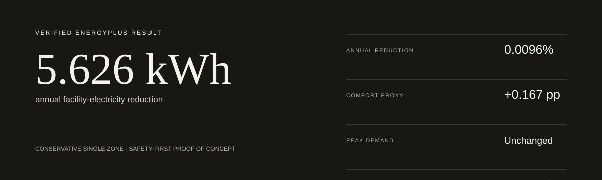
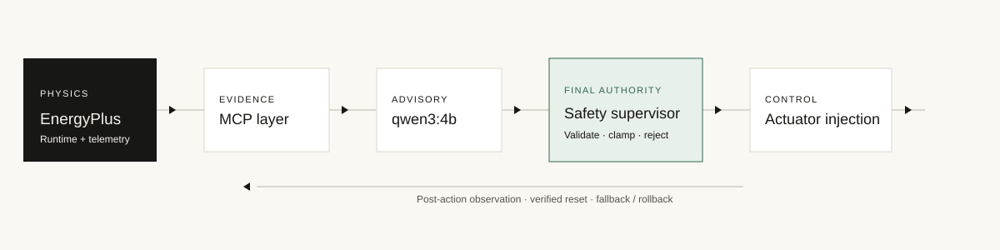

  ## Submission Deliverables

The complete Honeywell submission package, including all four required deliverables and the PoC demonstration video, is available here:

**[Download EcoPilot AI Deliverables 1–4](./EcoPilot_AI_Deliverables_1_to_4.zip)**

The ZIP contains:

1. Fully functional source code and setup instructions
2. EnergyPlus building model files (`.idf`)
3. Quantitative results, comparison exports, and reproducibility evidence
4. System architecture documentation
5. EcoPilot AI PoC demonstration video

   # EcoPilot AI

> A local, safety-supervised physical-AI loop that turns official EnergyPlus
> evidence into typed advisory actions, deterministic control, and reproducible
> proof.



## Verified result

The preserved compatible annual EnergyPlus experiment measured
**58,568.211908 kWh** for the fixed-schedule baseline and
**58,562.585832 kWh** for the safety-supervised controlled run:
**5.626076 kWh (0.009606%) lower**. Occupied-temperature proxy compliance
changed by **+0.167189 percentage points**, peak demand remained essentially
unchanged, PMV/PPD was unavailable, and severe/fatal errors were **0 / 0**.

## Architecture at a glance



EnergyPlus remains the source of physical truth. MCP exposes bounded local
evidence, qwen3:4b returns a compact typed advisory, and deterministic Python
validation plus the Phase 9 safety supervisor retain final actuator authority.
Applied actions are observed, resettable, and linked to persisted evidence.

## Quick start

```powershell
python -m venv venv
.\venv\Scripts\Activate.ps1
python -m pip install -r requirements.txt
Copy-Item .env.example .env
python -m pytest -q
python -m streamlit run app.py
```

The interface defaults to the **Command Center**, **Judge Mode**, and
**Verified Demo Replay**. Replay uses pre-generated verified artifacts and
does not require Ollama or an EnergyPlus rerun. Turn Judge Mode off only when
the preserved Developer Mode pages and explicit execution controls are needed.

**Safety-Supervised Autonomous EnergyPlus Building Control**

## 1. Project title

EcoPilot AI is an EnergyPlus-driven, local-first smart-building agent with
deterministic safety supervision and an auditable runtime-control path.

## 2. Summary

EcoPilot AI combines EnergyPlus, a local open-source LLM, MCP tools,
deterministic safety supervision, and runtime actuator control to demonstrate
an auditable closed-loop smart-building proof of concept. It preserves a strict
trust boundary: qwen3:4b may propose a typed cooling-setpoint adjustment, but
only deterministic validation and the Phase 9 safety supervisor can authorize
an EnergyPlus actuator write.

## 3. Problem statement

Building automation must balance energy, comfort, safety, reliability, and
explainability. A language model alone cannot safely control an HVAC actuator,
and a simulation-only optimization claim is weak unless the baseline and
controlled experiments use compatible models, weather, schedules, reporting,
and telemetry. EcoPilot AI addresses both issues with an EnergyPlus-first
architecture, bounded local evidence, deterministic final authority, and a
reproducible comparison gate.

## 4. Key capabilities

- Official annual EnergyPlus baseline with frozen model and weather hashes.
- Local MCP server exposing bounded, classified, audited evidence.
- Local qwen3:4b advisory inference through Ollama with thinking disabled,
  compact structured output, bounded context, and explicit timeouts.
- Typed proposals and deterministic validation before any control candidate.
- Real pyenergyplus actuator discovery, injection, observation, reset, fallback,
  and rollback handling.
- Phase 9 safety supervision covering comfort, demand, stale data, actuator
  mismatch, rate limits, and oscillation.
- Twenty-two of twenty-two fault scenarios passed, with all decision outcomes
  exercised and zero severe or fatal EnergyPlus errors.
- Compatible, aligned, claim-gated, reproducible Phase 10 comparison.
- Offline Streamlit product experience with Command Center, AI Copilot,
  Building, Analytics, Decisions, Safety, EnergyPlus, Reports, Guided Demo,
  Developer Mode, and project-scoped downloads.

## 5. Architecture

```text
EnergyPlus
  → runtime telemetry
  → bounded MCP tools
  → local qwen3:4b advisory
  → typed proposal
  → deterministic validation
  → Phase 9 safety supervisor
  → EnergyPlus actuator injection
  → post-action verification
  → rollback / fallback
  → compatible quantitative comparison
```

The LLM never writes directly to an EnergyPlus actuator. The dashboard's
Architecture page and [system architecture](docs/SYSTEM_ARCHITECTURE.md)
describe the full trust boundary.

## 6. Closed-loop workflow

1. EnergyPlus exposes runtime state through callback-safe telemetry snapshots.
2. MCP tools return bounded official evidence to the advisory layer.
3. qwen3:4b emits only the compact fields required for a typed proposal.
4. Python validates schema, evidence, bounds, deadband, freshness, and intent.
5. The Phase 9 supervisor approves, clamps, holds, rejects, falls back, or
   requests emergency recovery.
6. A verified `Zone Temperature Control | Cooling Setpoint | SPACE1-1`
   actuator is written only after approval.
7. Later callbacks compare the approved, applied, and observed setpoints.
8. Mismatch or unsafe state restores the fixed-schedule baseline.
9. Persisted telemetry and manifests support a separate annual comparison.

The final reproducible Phase 10 experiment uses the deterministic one-zone
policy rather than calling the LLM inside the annual EnergyPlus loop.

## 7. Safety design

The deterministic supervisor has final authority. It checks occupied
temperature, cooling/heating deadband, configured demand thresholds, stale
telemetry, change magnitude, rate limits, oscillation, and actuator
verification. Fault injection covers approve, clamp, hold, reject, rollback,
and emergency-fallback outcomes. This is prototype evidence, not production
safety certification or permission to deploy on a real building.

## 8. Official measured results

The retained verified comparison is an annual, 8,760-interval EnergyPlus
experiment:

| Measure | Fixed-schedule baseline | Safety-supervised controlled | Change |
|---|---:|---:|---:|
| Facility electricity | 58,568.211908 kWh | 58,562.585832 kWh | 5.626076 kWh lower |
| Facility electricity | — | — | 0.009606% lower |
| Occupied-temperature proxy compliance | 23.225357% | 23.392546% | +0.167189 percentage points |
| Peak demand | 21.050576909 kW | 21.050577252 kW | Essentially unchanged |
| Low-temperature violations | 11,014 | 10,990 | 24 fewer |
| High-temperature violations | 7 | 7 | No change |
| Severe / fatal errors | — | — | 0 / 0 |

At the configured assumptions of INR 8/kWh and 708 g CO₂/kWh, the measured
electricity difference derives to INR 45.008606 and 3.983262 kg CO₂. These are
assumption-based derived metrics, not native tariff or grid outputs.

## 9. Result interpretation and scope

> Under a fully aligned and reproducible EnergyPlus experiment, the
> safety-supervised one-zone control policy reduced annual facility electricity
> by approximately 5.626 kWh, or 0.0096%. Occupied-temperature proxy compliance
> improved slightly relative to the fixed-schedule baseline, while peak demand
> remained effectively unchanged.

The measured whole-building effect is small because this proof of concept
controls one zone conservatively under strict safety constraints. Genuine
PMV/PPD is unavailable in the retained example model, so the declared comfort
measure is occupied-temperature compliance. The project is not a real-building
deployment, a production optimizer, or a safety-certified controller.

## 10. Technology stack

| Technology | Role |
|---|---|
| Python | Typed orchestration, validation, tests, and artifact generation |
| EnergyPlus 26.1 | Official building simulation and telemetry |
| pyenergyplus Runtime/Data Transfer API | Callbacks, handles, actuator writes, observation |
| MCP | Local bounded tools and resources over stdio |
| Ollama | Local model serving |
| qwen3:4b | Advisory structured proposal |
| Streamlit | Offline-capable dashboard and evidence downloads |
| pandas, Altair, Plotly | Artifact processing and visual evidence |
| Pydantic | Typed boundaries and schema validation |

## 11. Repository structure

```text
app.py                         Streamlit entry point and grouped navigation
app_pages/                     Home, architecture, demo, phases, submission
ui/                            Shared presentation, charts, formatting, evidence
config/                        Frozen project and EnergyPlus settings
schemas/                       Typed data contracts
backends/                      Development and EnergyPlus abstractions
energyplus/                    Models, adapters, baseline, runtime control
mcp_service/                   Local MCP server, tools, resources, audit
llm/                           Ollama client, prompts, schemas, advisory agent
safety/                        Deterministic Phase 9 supervisor and rules
comparison/                    Phase 10 compatibility, metrics, claim gate
scripts/                       Explicit runners and export commands
tests/                         Phase 1–11 regression and UI tests
docs/                          Architecture, methods, demo, submission documents
results/                       Generated classified evidence and exports
```

## 12. Installation

Python 3.12 is the verified interpreter. From the repository root:

```powershell
python -m venv venv
.\venv\Scripts\Activate.ps1
python -m pip install --upgrade pip
python -m pip install -r requirements.txt
Copy-Item .env.example .env
```

The application itself uses local files and services only; it does not require
internet access at runtime.

## 13. EnergyPlus setup

Install EnergyPlus 26.1 and configure the existing variables in `.env`:

```text
ENERGYPLUS_HOME=<EnergyPlus installation directory>
ENERGYPLUS_EXECUTABLE=<EnergyPlus executable>
ENERGYPLUS_IDD=<Energy+.idd>
ENERGYPLUS_MODEL=energyplus\models\base\phase4_base_model.idf
ENERGYPLUS_WEATHER=energyplus\weather\phase4_weather.epw
```

The retained models are:

- Baseline IDF: `energyplus/models/baseline/phase5_baseline.idf`
- Runtime-derived IDF: `energyplus/models/modified/phase4_telemetry_model.idf`

Check discovery without starting a simulation:

```powershell
python -m scripts.run_phase4_energyplus --help
```

## 14. Ollama and qwen setup

Install Ollama separately, pull `qwen3:4b`, and keep the existing Ollama service
running:

```powershell
ollama pull qwen3:4b
ollama ps
ollama run qwen3:4b --think=false "Reply with only ready"
python -m scripts.check_ollama
```

The live demonstration defaults are already represented in `.env.example`:
thinking disabled, 180-second requests, 360-second overall agent timeout, four
tool rounds, one retry, 192 generated tokens, and a 4,096-token context. Local
inference latency depends on CPU, memory, model state, and thermal conditions.

## 15. Running the application

```powershell
python -m streamlit run app.py
```

The default sidebar is product-centric: Command Center, AI Copilot, Building,
Analytics, Decisions, Safety, EnergyPlus, and Reports. Judge Mode keeps the
preserved Phase 1–11 routes registered but hidden from the primary judge flow.
Developer Mode exposes those technical routes and their original explicit run
controls. Verified Demo Replay is the default source; Live Services is opt-in.
No simulation, MCP session, fault suite, or Ollama request starts on page load.

## 16. Running validation scripts

Use explicit commands; these operations are never triggered by navigation:

```powershell
python -m scripts.run_phase9_safety_validation
python -m scripts.run_phase10_comparison
python -m scripts.verify_phase10_reproducibility
python -m scripts.build_phase10_submission_exports
python -m pytest -q
```

Phase 9 and Phase 10 EnergyPlus runs can take several minutes.

## 17. Reproducing Phase 10

The official sequence is:

```powershell
python -m scripts.run_phase10_controlled_evaluation
python -m scripts.run_phase10_comparison
python -m scripts.verify_phase10_reproducibility
python -m scripts.build_phase10_submission_exports
```

The compatibility gate requires matching EnergyPlus source/version, immutable
base model, derived model relationship, weather, run period, reporting,
occupancy, loads, zone mapping, expected intervals, critical telemetry, and
error policy. Control injection and safety authority must also be verified.

## 18. Viewing artifacts

Use the dashboard's **Evidence & downloads** page for project-scoped paths and
safe downloads. Principal roots are:

- `results/official/`
- `results/audit/`
- `results/agent/phase7/`
- `results/closed_loop/phase8/`
- `results/safety/phase9/`
- `results/comparison/phase10/`
- `results/submission/phase11/`

Generated artifacts can retain machine-local provenance internally. The UI and
documentation display repository-relative paths.

## 19. Demo flow

Keep Judge Mode and Verified Demo Replay enabled, open **Command Center**, and
select **Start guided demo**. The seven deterministic scenes cover status,
telemetry, saved qwen3:4b evidence, safe control, unsafe rejection, analytics,
and the approved closing claim. The timed narration and backup plan are in
[`docs/DEMO_SCRIPT.md`](docs/DEMO_SCRIPT.md). Do not wait for a live annual
EnergyPlus run or cold local-model response during a three-minute presentation.

## 20. Documentation index

- [System architecture](docs/SYSTEM_ARCHITECTURE.md)
- [LLM, prompt, and latency design](docs/LLM_AGENT.md)
- [Agent prompting contract](docs/AGENT_PROMPTING.md)
- [Runtime control](docs/ENERGYPLUS_RUNTIME_CONTROL.md)
- [Safety supervisor](docs/PHASE9_SAFETY_SUPERVISOR.md)
- [Comfort and PMV policy](docs/COMFORT_AND_PMV_POLICY.md)
- [Phase 10 method](docs/PHASE10_QUANTITATIVE_COMPARISON.md)
- [Final results](docs/FINAL_RESULTS.md)
- [Reproducibility](docs/REPRODUCIBILITY.md)
- [Demo script](docs/DEMO_SCRIPT.md)
- [Phase 12 hackathon demo experience](docs/PHASE12_HACKATHON_DEMO.md)
- [Presentation outline](docs/PRESENTATION_OUTLINE.md)
- [Submission checklist](docs/SUBMISSION_CHECKLIST.md)
- [Official requirements mapping](docs/OFFICIAL_REQUIREMENTS_MAPPING.md)

## 21. Submission deliverables

The source repository, requirements, IDFs, architecture report, final dashboard,
compact comparison export, reproducibility report, demo video, presentation,
screenshots, disclosure text, and final packaging checks are indexed in
`results/submission/phase11/SUBMISSION_INDEX.md`. The adjacent manifest
references evidence instead of duplicating large raw telemetry.

## 22. Known technical constraints

- The experiment controls one zone in a retained example EnergyPlus model.
- Genuine PMV/PPD is unavailable; occupied-temperature compliance is a proxy.
- The annual reproducibility policy is deterministic and does not prove that
  the LLM created the measured savings.
- Local qwen3:4b latency is hardware-dependent and unsuitable for an
  EnergyPlus callback.
- Prototype demand thresholds require site engineering before deployment.
- INR tariff and carbon intensity are configured assumptions.
- Peak demand is effectively unchanged.
- No real-building deployment or production safety certification is claimed.
- Generated official artifacts are intentionally ignored by default and must
  be packaged deliberately.

## 23. Future work

- Expand conservative control to multiple zones with coordinated constraints.
- Add EnergyPlus People inputs that expose native PMV/PPD and validate them.
- Calibrate demand guardrails, tariffs, carbon intensity, and comfort policy to
  an actual site.
- Evaluate additional weather years, building types, and operating schedules.
- Move advisory inference to appropriate local hardware while preserving the
  same typed and deterministic trust boundary.
- Commission against a read-only building-management-system shadow deployment
  before considering any controlled pilot.

